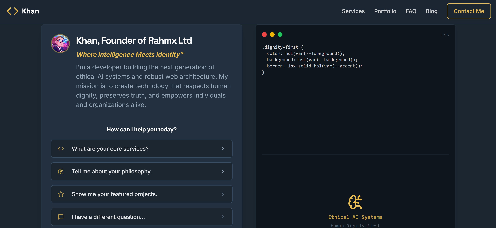
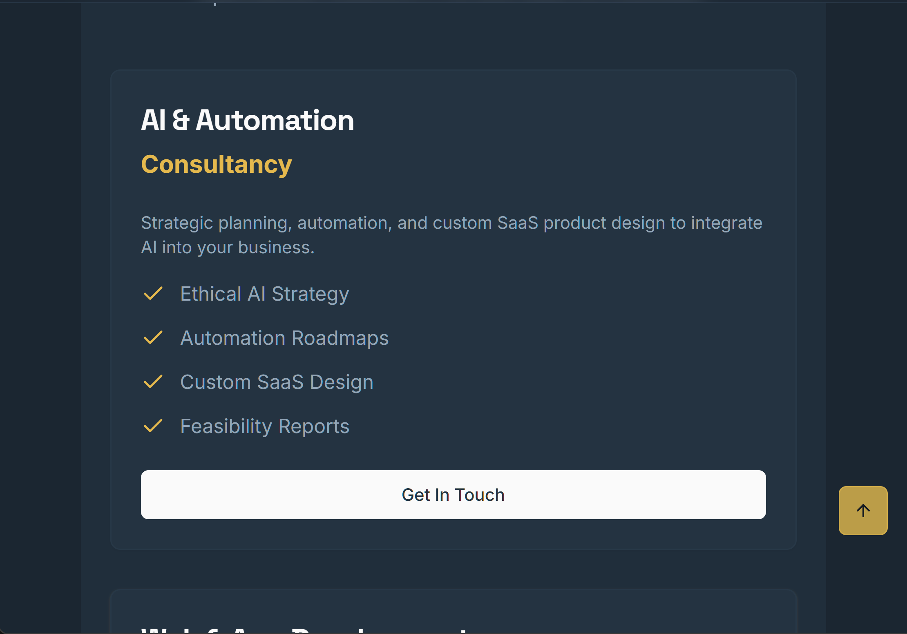
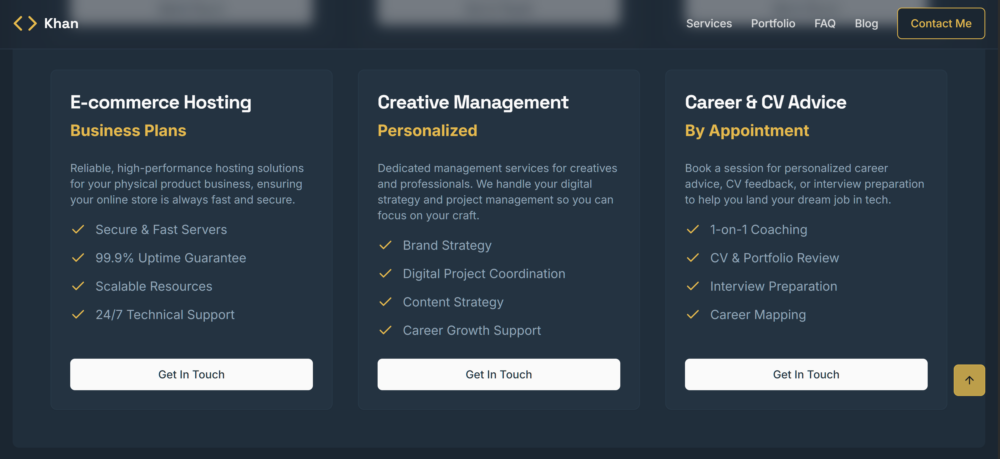
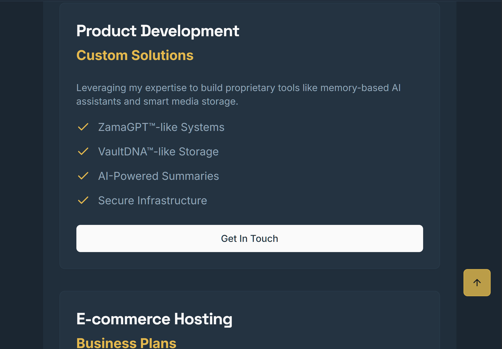
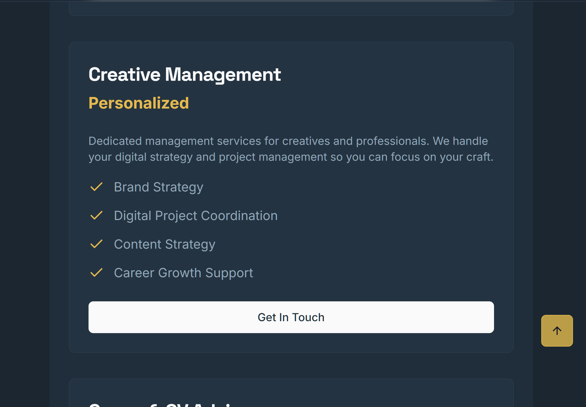
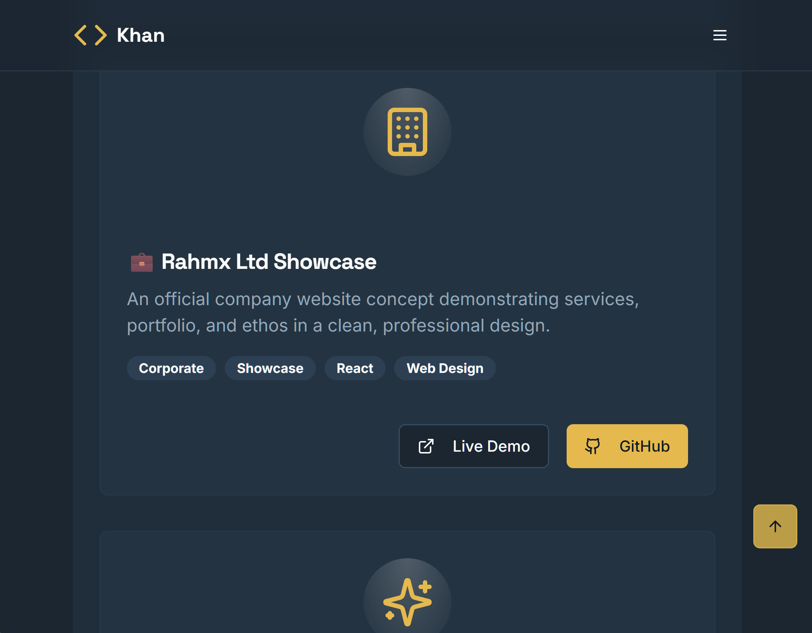

# Portfolio

This is the official portfolio and showcase for **Khan**, Founder of Rahmx Ltd.  
A full‑stack Next.js, TypeScript & Tailwind CSS application demonstrating web architecture, ethical AI systems, and branded digital experiences.  
“Where Intelligence Meets Identity™”

---

## 🌐 Live Demo & Corporate Site

**Live Portfolio:** [https://khan.rahmx.co.uk](https://khan.rahmx.co.uk)  
**Rahmx Ltd:** [https://www.rahmx.co.uk](https://www.rahmx.co.uk)

---

## 🔍 Philosophy & Vision

1. **ZamaGPT™ Framework**  
   Ethical AI memory model built on sacred principles of memory and knowledge.  
2. **Human Dignity & Truth**  
   Technology that serves humanity and combats misinformation.  
3. **Pioneering Innovation**  
   Pushing the boundaries of web architecture and AI.

---

## 🛠 Services & Offerings

- **AI & Automation Consultancy**  
- **Full‑Stack Web & App Development**  
- **Custom Products**  
- **ZamaGPT™ memory assistant**  
- **VaultDNA™ secure media gallery**  
- **E‑Commerce & Business Hosting**  
- **Creative & Personal Management**  
- **Career & CV Advice**

---

## 💼 Featured Projects

| Project                   | Demo & Details                                                                              |
|---------------------------|---------------------------------------------------------------------------------------------|
| ZamaGPT™ Demo             | Ethical, memory‑based AI assistant _(Access by request)_                                    |
| VaultDNA™ Gallery         | Secure media storage solution _(Access by request)_                                         |
| Rahmx Ltd Showcase        | Corporate site concept: [rahmx.co.uk](https://www.rahmx.co.uk)                              |
| DemoX‑Reimagined          | AI branding template: [Live Demo](https://rahmx-reimagined.web.app)                        |
| Demo‑Spice‑Hub            | Restaurant starter kit: [Live Demo](https://menuverse-919eu.web.app)                        |

---

## 💸 Pricing & Service Options

| Tier       | Description                                              | Price (GBP) |
|------------|----------------------------------------------------------|-------------|
| Starter    | Website clone with contact form setup                    | £2,500      |
| Pro        | Brand customization + Firebase deployment                | £8,000      |
| Agency     | White‑label license + ZamaGPT integration + dashboard    | £25,000     |

📩 For partnerships, bulk licensing, or custom requests: **info@rahmx.co.uk**

---

## 🤝 Join, Collaborate & Learn

I’m always looking for passionate collaborators and fresh ideas. Whether you’re a developer, designer, or AI enthusiast, let’s build something amazing together:

- **Collaborate on Projects:** Got an idea for an ethical AI tool, web app, or automation workflow? Let’s partner up—drop me a line at info@rahmx.co.uk.  
- **Share Your Ideas:** Have a concept or challenge you want to solve? I love brainstorming new solutions—reach out anytime!  
- **Courses Coming Soon:** Stay tuned for online courses on Next.js, Tailwind CSS, AI prompt engineering, and ethical memory‑powered systems.  
- **Learn Alongside Me:** Want to pick up these skills yourself? Subscribe to my YouTube channel for tutorials, walkthroughs, and live coding sessions:  
  [YouTube: Khan's Digital Diary](https://www.youtube.com/channel/khansdigitaldiary)  
- **Join the Community:** Follow me on LinkedIn and Twitter for tips, resources, and updates as each course and project goes live.

Let’s learn, innovate, and shape the future of ethical technology—together!  ```

---


## ⚙️ Tech Stack

- **Framework:** Next.js (App Router)  
- **Language:** TypeScript  
- **Styling:** Tailwind CSS  
- **UI Library:** ShadCN UI  
- **Icons:** Lucide  
- **AI Integration:** Google AI & Genkit  
- **Deployment:** Firebase Hosting (or Vercel / Netlify)  

---

## 🖼️ Screenshots & Pitch Pack

## 📸 Screenshot Previews

Below are the visual previews stored in the `/demo-assets/` folder:

### 🔹 Asset 1


### 🔹 Asset 2


### 🔹 Asset 3


### 🔹 Asset 4


### 🔹 Asset 5


### 🔹 Asset 6


### 🔹 Asset 7


### 🔹 Asset 8



---

## 🤝 Connect & Grow

- **Join the Mission:** for developers passionate about ethical AI  
- **Invest in the Future:** for partners sharing our vision  
- **Free Starter Kit:** downloadable resources to kickstart your journey

---

## 📬 Contact

- **Email:** info@rahmx.co.uk  
- **Website:** [www.rahmx.co.uk](https://www.rahmx.co.uk)

---

© 2025 Khan / Rahmx Ltd — Where Intelligence Meets Identity™

---

## Local Installation & Setup

To run this project locally, follow these steps:

1.  **Clone the repository:**
    ```bash
    git clone https://github.com/your-username/your-repo-name.git
    cd your-repo-name
    ```

2.  **Install dependencies:**
    This project uses `npm` as the package manager.
    ```bash
    npm install
    ```

3.  **Set up environment variables:**
    Create a file named `.env.local` in the root of the project and add the necessary environment variables. You can use `.env.example` as a template if one is provided.
    ```env
    # For Resend (Newsletter)
    RESEND_API_KEY=your_resend_api_key
    MAIL_TO=your_email@example.com

    # For Contentful (Blog) - Optional
    CONTENTFUL_SPACE_ID=your_space_id
    CONTENTFUL_ACCESS_TOKEN=your_access_token

    # For Google Analytics - Optional
    NEXT_PUBLIC_GA_TRACKING_ID=G-XXXXXXXXXX
    ```

4.  **Run the development server:**
    ```bash
    npm run dev
    ```
    The application will be available at [http://localhost:9002](http://localhost:9002).

5.  **Build for production:**
    ```bash
    npm run build
    ```

---
